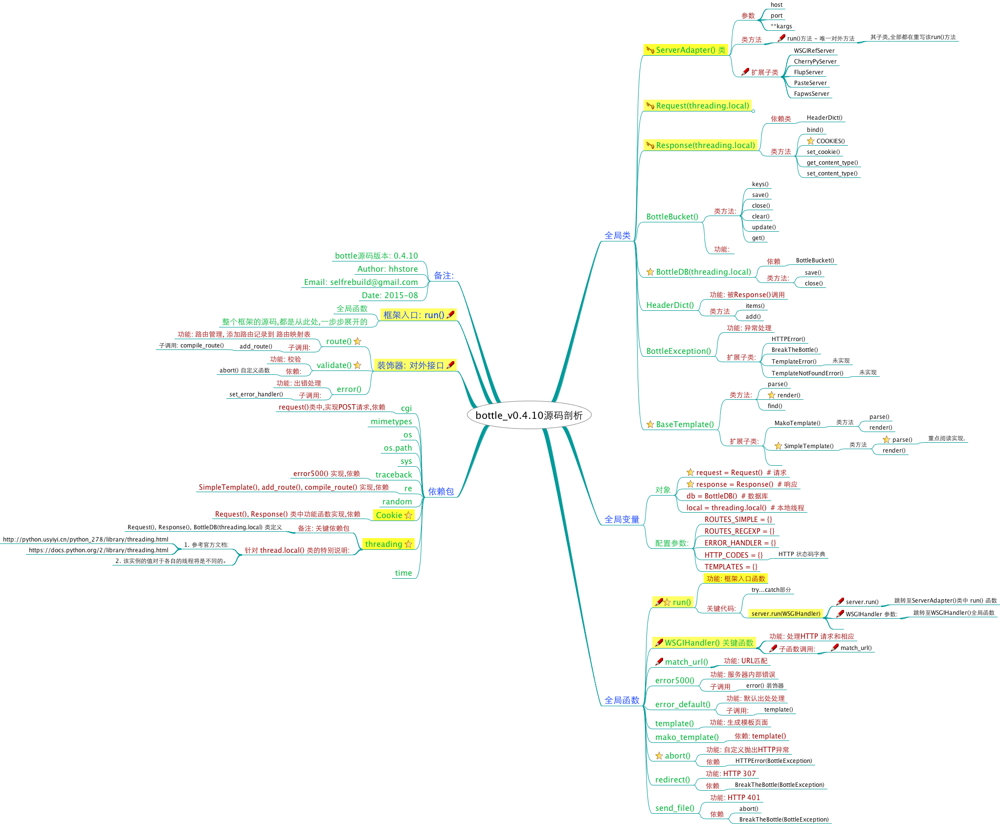

# bottle-annotated

## 项目说明:

- 本项目是 [bottle]() 框架源码的注解版本.
- 注解代码中,包含大量注释.(个人理解,不保证正确性,如有误请指出,谢谢)
- 提供源码的"思维导图"(也就是源码的结构)辅助理解.
- 首选第一个注解版本为: bottle_v0.4.10, 该版本的代码不到1000行,很适合阅读.
- 欢迎有兴趣的小伙伴,一起来注解更多版本.

## 候选注解版本列表:
- v0.6.6
- v0.8.5
- v0.9.7
- v0.10.11

## 关于 `bottle` 项目

- `bottle` 原项目地址: https://github.com/bottlepy/bottle
- `bottle-py` 是一个很 micro 的 python web 框架.
- `bottle-py` 初始版本代码,不到1000行.很值得深入学习.
- 关于 `bottle-py` 的使用方法,请参考官方项目文档.非常详尽.

## 注解版本示例: bottle_v0.4.10

