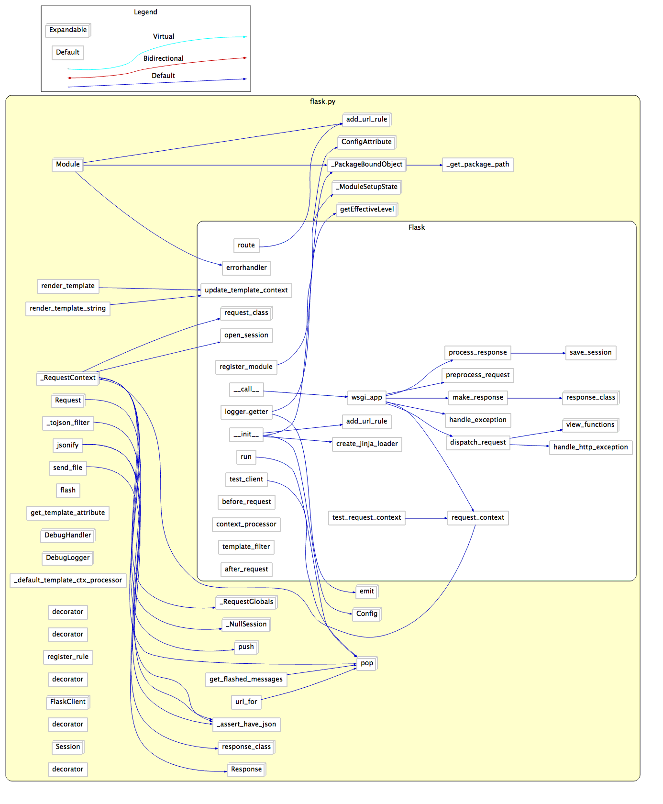
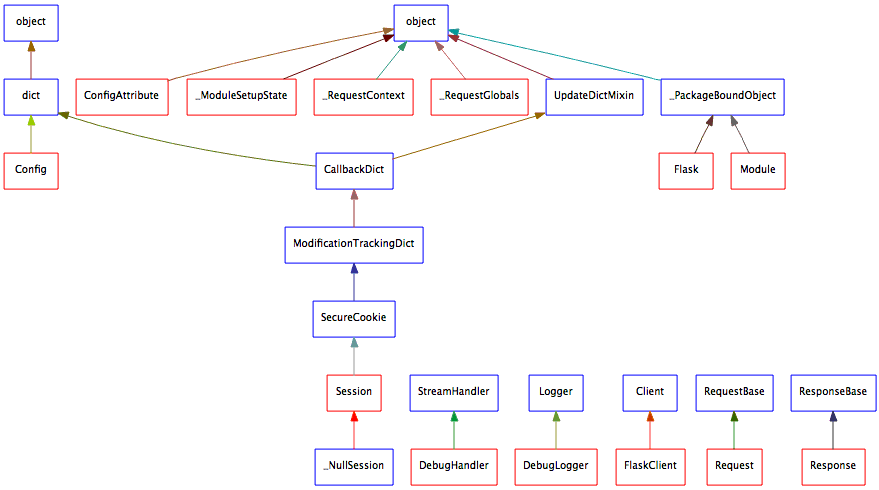
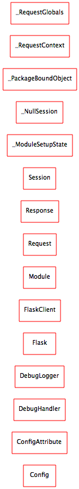

# flask 0.4 版本说明:

## 1. 点评:

- v0.4 版本, 是flask 项目, 单文件实现, 最后一个版本.
- 代码很精简.值得打印阅读.

## 2. 源码结构图:

### 2.1 flask 内部模块调用关系:

- 图1:

- 图2:

- 图3:

### 2.2  flask 依赖模块:

### 2.3 flask 模块 UML 图:

- 图1:

- 图2:

- 图3:

## 3. Web 知识点补缺:

- [flask 中的 上下文 g, session 实现]()
- [session 和 cookie 的区别和联系]()
    - [Cookie与Session的区别](http://www.lai18.com/content/407204.html)
- [理解WSGI]():
    - [WSGI-维基](https://zh.wikipedia.org/wiki/Web%E6%9C%8D%E5%8A%A1%E5%99%A8%E7%BD%91%E5%85%B3%E6%8E%A5%E5%8F%A3)
    - [戏说WSGI（Python Web服务网关接口）](http://www.cnblogs.com/holbrook/archive/2012/02/25/2357337.html)
    - [WSGI 是什么 以及如何使用](http://zsl-oo7.blog.163.com/blog/static/353297032013111510441430/)
- [深入理解 `上下文` 概念]()

## 4. 源码阅读经验总结:

- 通读:
    - 第一步, 建立对代码的整体印象
    - 实际效果有限, 收获 20% 的简单部分
- 略读:
    - 大部分模块, 都属于不太重要的. 
    - 很简单, 读过即可.
- 精读:
    - 少数模块, 属于核心模块(通常都是难懂的部分), 需要精读, 花大量时间深入读, 不要畏难.
    - 核心模块的代码, 很难懂, 要硬着头皮一点点啃, 否则, 就失去阅读源码的价值. (难点,全没搞懂,等于白读)
    - 八二定则: 80%的精力, 应该花在 阅读 20% 的关键代码上.
- 带着问题, 有针对性的去阅读重要模块.
    - 教训: 某次面试, 被问到 flask 中 g, session 实现, 发现 记忆很模糊,不敢答.结果回来发现,原来读源码的时候,没有重视这几个点
    - 重新带着问题读, 发现深入 核心模块, 收获很多.
    - 待着问题读, 通常目标明确, 为了搞明白某些问题, 就会深入读, 不会浮光掠影
    - 盲目的读, 通常很多代码, 看过去, 表面上看得懂, 但是, 并没有理解 这些 操作步骤 背后的逻辑和思想.(丢失了最有价值的部分)
- 故书不厌百回读.
    - 代码也是, 常读, 常新.
    - 温故而知新.
    - 能力较弱时, 读很多实现, 就像 初读 "文言文", 都认识, 但是不明白在说什么.
    - 能力提升时, 原本看不懂的地方, 读不出来的东西, 慢慢就能多读出一点.
    - 能力足够时, 就能读明白 框架源码 每一个角落, 而不会 避重就轻的 缺失 重要部分.
    - 切记: 不要以为读了一遍, 就完事了. too young, too simple.
    
